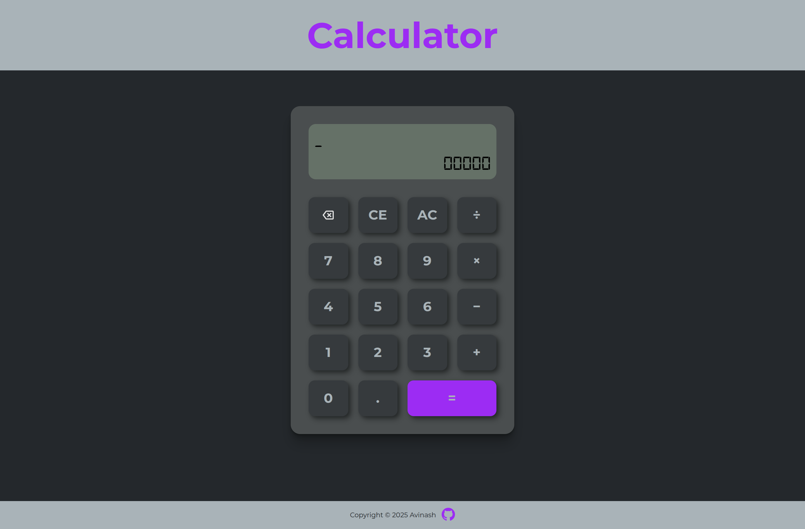

🌐 Live Demo

[Click here](https://avinash4364.github.io/Calculator/) to use the Calculator

# 🧮 Smart JS Calculator

A robust, logic-first calculator built with JavaScript. This project focuses on high-reliability math processing, handling operator precedence (PEMDAS/BODMAS), and unit testing.



## 🚀 Features

-   **PEMDAS Logic:** Correctly handles mixed operations like `10 + 20 * 30 / 10`.
-   **Error Boundaries:** Prevents common calculator crashes like division by zero or malformed expressions.
-   **Floating Point Accuracy:** Handles JavaScript's decimal precision issues.

## 🧪 Testing Suite

Quality assurance was a priority for this project. I built a testing suite with **50+ test cases** using **Jest** to cover:

-   Standard arithmetic.
-   Complex, multi-step expressions.
-   Edge cases (negative results, leading operators).
-   Invalid operations and data sanitization.

### Running the Tests

To see the logic in action and verify the code:

```bash
# Install dependencies
npm install

# Run the test suite
npm test

```

## 🛠️ Technical Implementation

-   **Algorithm:** Implemented logic to convert infix expressions to a valid result.
-   **Validation:** Built a defensive validation layer that checks for "Impossible States" (e.g., consecutive numbers like `["10", "20"]`) before attempting calculation.
-   **Module System:** Built using **CommonJS** for seamless integration with Node.js testing environments.

## 🧠 What I Learned

-   **Defensive Programming:** How to handle "impossible" user inputs even if the UI prevents them.
-   **Benefits of writing tests:** Writing tests and building logic to pass them.
-   **CSS Box Shadow:** Using box-shadow inset value to make a button look like pressed

---

## Credits

-   Credits for the icons: [Flaticon](https://www.flaticon.com/icons)
-   [The Odin Project](https://www.theodinproject.com/lessons/foundations-calculator)
